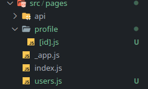
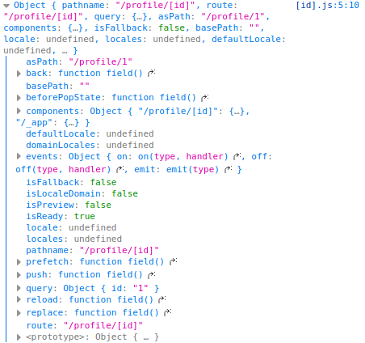
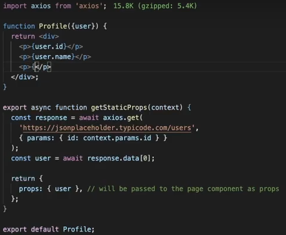
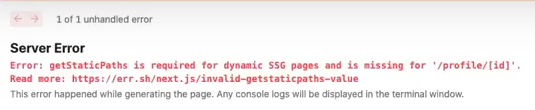

# Guia básico de como usar o Next JS


## Vantagens

- Sistema de navegação entre páginas (exclue a necessidade de usar o react router dom)
- Capacidade para fazer construções de páginas no <i>client side</i> ou <i>server side</i>
- Alternativa para melhores resultados de SEO
- Ótimo para escalabilidade de projetos

<br>

## Instalação

#### Usando javascript

```
npx create-next-app@latest
```

#### Usando typescript

```
npx create-next-app@latest --ts
```

### Iniciando o projeto

```
npm run dev
```

Ao usar o react puro, a renderização é feita automaticamente no lado do cliente, como se fosse um app criado com <i>create react app</i>

## Requisição simples renderizada no lado do cliente

```
import axios from "axios";
import { useState, useEffect } from "react";

const Users = () => {
  const [users, setUsers] = useState([]);

  const fetchUsers = async () => {
    const response = await axios.get(
      "https://jsonplaceholder.typicode.com/users"
    );
    const data = await response.data;

    setUsers(data);
  };

  useEffect(() => {
    fetchUsers();
  }, []);

  console.log(users);

  return (
    <div>
      {users.map((user) => (
        <div key={user.id}>{user.name}</div>
      ))}
    </div>
  );
};
export default Users;

```

Um problema é que no código fonte, não vem o html pronto, pois a renderização ocorreu em run time no lado do cliente, afetando o SEO na página.
A mesma renderização agora no lado do servidor:

```
import axios from "axios";

const Users = ({ users }) => {
  return (
    <div>
      {users.map((user) => (
        <div key={user.id}>{user.name}</div>
      ))}
    </div>
  );
};
export default Users;

export async function getServerSideProps(context) {
  const response = await axios.get(
    "https://jsonplaceholder.typicode.com/users"
  );
  const data = await response.data;

  return {
    props: { users: data },
  };
}

```

Dessa forma, trazemos para a página web já o html pronto, que vai ajudar em muito na avaliação do SEO da página.

Porém o next.js também renderiza páginas estáticas, antes de prosseguir só um <i>disclaimer</i>

- SSR: ele atua no tempo de execução, ou seja, a todo momento que for requisitado, ele irá no servidor para buscar as informações.

- SSG: ele atua no momento de build, ou seja, geração da página, ele já entrega para o browser uma página estática, com o html completo (assim como no SSR).

<br>

No SSG (Static Site Generation) - as páginas ficam salva em um servidor CDN, ao fazer a request, ele apenas devolve o html, sem a necessidade do javascript para 'montar' a página

Antes de continuar com o SSG, é preciso explicar o que são rotas dinâmicas no next.js

<br>

Este componente, perceba que foi usado [] ao redor do arquivo, isso indica que este arquivo é mutável, por exemplo, um item de uma lista de produtos de e-commerce, que poderá ser diferente de acordo com o produto que o cliente escolheu.



```
import { useRouter } from "next/dist/client/router";

const Profile = () => {
  const router = useRouter();
  console.log(router);

  return <h1>Profile</h1>;
};

export default Profile;
```

Ao dar console.log, temos o seguinte resultado, lembre-se que a url está dessa maneira:

```
http://localhost:3000/profile/1
```



<br>

Note, que no final, em query.id, temos o mesmo valor passado na URL acima id = 1

<br>

<b>Importante</b>

<br>

<p>Se quisermos passar o nome do item do nosso e-commerce, utilizaremos o hook `useRouter` <br> e a partir disso, poderemos salvar o dado em uma variável:<br>

```
const router = useRouter();
const data = router.query.id;
console.log(data);
```

<br> A partir desse data, podemos fazer uma nova requisição, por exemplo.<br></p>

Voltando ao exemplo, o método <i>getStaticProps</i> é uma outra maneira de pegar dados do servidor, segue o código:

<center>
</center>
<br>
Perceba que sintaticamente, é bem similar, mas há uma diferença muito importante. Se você tentar rodar esse código em uma rota dinâmica, como no nosso exemplo `[id].js` dará um erro
<br> E faz sentido dar erro concorda? Afinal você quer renderizar uma página dinâmica como estática???
<br><br>

<center>
</center>

Mas para esse problema também há solução, usando o famoso `getStaticPaths`

Bom gente, daqui pra frente pode ficar meio difícil entender sem ver algum vídeo ou ler a documentação, deixo aqui um vídeo para vocês verem antes de continuarmos:

<a href="https://www.youtube.com/watch?v=V2T_bkOs0xA" target="_blank">
</a>

## Então vamos

1. Entendendo o que é `getStaticPaths`, diferentemente dos anteriores, essa função do next não visa rotular de que modo as páginas serão feitas, mas sim o caminho. Para explicar, segue a estrutura básica fornecida pela própria documentação:

```
export async function getStaticPaths() {
  return {
    paths: [
      { params: { ... } } // See the "paths" section below
    ],
    fallback: true, false, or 'blocking' // See the "fallback" section below
  };
}
```

Se você viu o vídeo que recomendei, do grande teló da TI, você já sabe o que significa o paths e o fallback, mas caso não tenha visto, aqui vai uma explicação básica com base no código do vídeo:

```
export async function getStaticPaths() {
  return {
    paths: [
      {
        params: { id: "1" },
        params: { id: "2" },
      },
    ],
    fallback: 'false',
  };
}

export async function getStaticProps(context) {
  const id = context.params.id;

  return {
    props: {
      id: id,
    },
  };
}

const Produtos = (props) => {
  return <div>Id do produto: {props.id}</div>;
};

export default Produtos;
```

Ao usar esse código, você pode perceber algumas coisas:

- O context do getStaticProps é o mesmo objeto do params, dentro de `getStaticPaths`
- Para cada item do objeto params, será rodado um `getStaticProps` e armazenará esta página em alguma CDN
- Perceba que o id foi passado como <i>string</i>, pois a URL pode receber ao invés de número um item da lista

### fallback

Entramos no fallback, e aqui está a cereja do bolo. Ele é quem define como as páginas serão geradas, aceitando 3 valores: `false`,`true`,`blocking`

#### fallback: false

Para cada id listado em `getStaticPaths`, ele gerará uma <b>página estática</b>

#### fallback: true

Para os id's não listados em `getStaticPaths` ele tentará gerar uma página estática, de forma assícrona

#### fallback: blocking

Assim como no `getServerProps`, ele irá bloquear a página, até que a requisição seja feita com sucesso.
Lembre-se de colocar blocking entre aspas, pois ele não é um valor booleano
<br><br>

## Importante

Uma vez gerando uma página fazendo dessa maneira, de forma assícrona ou bloqueante, ela fica em cache, caso esteja hospedando a plataforma na Vercel ela será armazenada em uma das CDN deles e a replicada globalmente, ou seja, nas próximas consultas, a página será retornada imediatamente

Bom, se é a sua primeira vez, você pode ter ficado meio zonzo, vamos relembrar o que vimos:

<center><h3>SPA (Single Page Application) </h3></center>

Renderizada no lado do cliente, o javascript controla a montagem da página, boa perfomance..

1. Negativo: afeta muito o SEO da página, caso seja uma aplicação imensa, o primeiro carregamento pode demorar muito.
2. Positivo: ideal para usar em páginas que possui uma alta interatividade com o usuário
   <br>

<center><h3>SSR (Server Side Rendering) </h3></center>

Bom para SEO, pois retorna o html pronto para o cliente, renderização ocorre no lado do servidor em tempo de execução (no momento que é solicitado a request).

1. Negativo: menor performance quando comparada com a SPA, caso haja muitas requisições para o mesmo servidor pode dar um problema de demanda e o site não funcionar corretamente.
2. Positivo: boa para carregar páginas realmente pesadas, não deixando na mão da máquina e internet do cliente, renderizá-la

<center><h3>SSG (Static Site Generation) </h3></center>

Gera uma página estática, renderizada em algum servidor e depois, distribuida globalmente, ocorre no momento de build, ou seja, no momento em que ocorre o carregamento da página, pode ser implementada de duas maneiras:

1. `getStaticProps` -> Para páginas que não possuem uma rota URL dinâmica
2. `getStaticProps` e `getStaticPaths` -> usadas em conjunto quando o objetivo é criar uma página estática porém com caminho dinâmico.

Bom, depois desse mega resumão você pode ter pensado, bom é isso chega. MASSSSSSSS

Ainda o next nos mostra mais uma resolução acredite se quiser, mas antes de explicar ela, é necessário te mostrar o porquê ela foi criada. Perceba que ao criar uma página estática e mandar para o servidor, já era, pois agora a página está lá, fixa, se ouver alguma alteração não poderá ser feito nada.

<br>
<center><h3>ISR (Incremental Static Generation)</h3></center>

- Ele possui o mesmo funcionamento do SSG
- Possui um re-render em background
- Liberada a partir da versão 9.5 do next.js
- Páginas estáticas geradas em run time

Pegando o mesmo código usado acima:

```
export async function getStaticPaths() {
  return {
    paths: [
      {
        params: { id: "1" },
        params: { id: "2" },
      },
    ],
    fallback: "blocking",
  };
}

export async function getStaticProps(context) {
  const id = context.params.id;

  return {
    props: {
      id: id,
    }, revalidate:10
  };
}

const Produtos = (props) => {
  return <div>Id do produto: {props.id}</div>;
};

export default Produtos;

```

Perceba que em props no `getStaticProps` passamos também o atributo <i>revalidate</i>, este atributo significa, faça uma checagem a cada X segundos, no nosso caso, é a cada 10 segundos, ou seja, regenere essa página a cada 10 segundos.

<center><h2>Congratulations !!!</h2></center>

Se chegou até aqui, passou pelo mais difícil do next.js, daqui para frentes são pequenos detalhes que não podem passar despercebidos, porém possui uma complexidade bem menor quando comparado com os conceitos acima.

## Imagens

Uma coisa muito massa que o next trás consigo, é a otimização de imagens, segue o exemplo de como usá-la:

```
import Image from 'next/image'

const YourComponent = () => (
  <Image
    src="/images/profile.jpg"
    height={144}
    width={144}
    alt="Your Name"
  />
)

```

Ele já retorna um componente imagem, você precisa passar uma largura e altura inicial, lembre-se, caso esteja usando algum pré processador de css ou um <i>styled components</i>
você pode sobrescrever essa largura e alura, tendo uma imagem mais leve já que está otimizada.

## Navegação entre as páginas

Bom, você já sabe criar de 4 formas diferentes as páginas, e como acessá-las sem passar os parâmetros na url?

Se você usava/usa o `react router dom` isso será moleza, pois o processo é bem parecido

```
import Link from 'next/link';

<h1 className="title">
  <Link href="/posts/first-post">
    <a>this page!</a>
  </Link>
</h1>
```

Aqui criamos um título clicável, porém você poderia substituir por um `button` ou `a`
Note que o caminho está no componente Link, próprio do next JS.

Caso queira passar uma outra rota como por exemplo:

```
html://site.com/posts/front-end-2021
```

Você passaria um `href="/posts/front-end-2021"`<br><br>
Acessando a página principal: `href="/"`

Esse grande resumo foi fruto de uma semana muito intensa de estudos, e não poderia deixar de dar o crédito dos grandes educadores com quem aprendi, clique para ser redirecionado ao conteúdo deles relacionado a next js:

<div width="260">
  
    <br>
    <a href="https://www.youtube.com/watch?v=Ffdn4R-tpNw&list=PLkFMdTTdI9c3m6R-JinONx3ha3CsBy2hB" align="center" target="_blank">Lucas Nhimi</a>
</div>

<div>

<br>
<a href="https://www.youtube.com/watch?v=V2T_bkOs0xA" target="_blank"><p>Filipe Deschamps</p><a>
</div>

<div>
  <a href="https://www.youtube.com/watch?v=u1kCtkVR7cE" target="_blank">
    
    <p>Diego Rocketseat</p>
  <a>
</div>

Se você sabe de mais alguma informação e acha pertinente adicioná-la, vá em frente, ou algum erro que cometi, faça o favor de arrumar kk e me mandar um PR

Espero que ajude nos seus estudos, sempre em busca do próximo nível 🚀🚀
